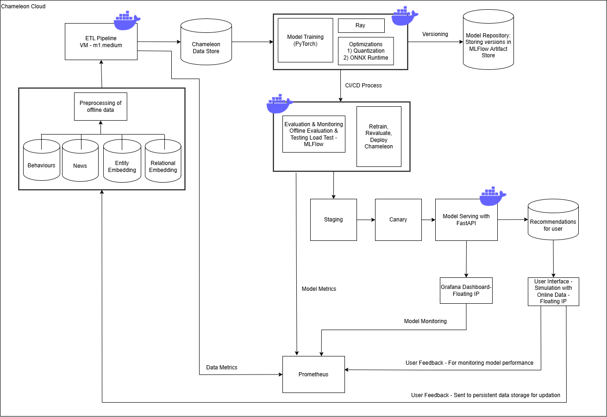

### ECE-GY 9183: Machine Learning Systems Engineering and Operations

---

## Real-Time News Recommnedation System

---

<!-- 
Discuss: Value proposition: Your will propose a machine learning system that can be 
used in an existing business or service. (You should not propose a system in which 
a new business or service would be developed around the machine learning system.) 
Describe the value proposition for the machine learning system. What’s the (non-ML) 
status quo used in the business or service? What business metric are you going to be 
judged on? (Note that the “service” does not have to be for general users; you can 
propose a system for a science problem, for example.)
-->

In the age of desperate dopamine and short attention spans, news providers like Microsoft and Google must capitalize on accurate and targeted recommendations to maintain user engagement. These platforms aim to serve relevant news articles instantly as browser tiles, app notifications, or feed updates, thereby encouraging users to consume more content and spend more time on the platform. 

Very important Key Performance Indicators (KPIs) which measure the success of the model are behavioral metrics such as
- Click-through rate (CTR)
- Average session duration (Dwell Time)
- Daily active users (DAU)  
These are main factors driving monetization through ad revenue and long-term user retention.

Currently, many news recommendation systems rely on simple heuristics or collaborative filtering methods that do not adapt quickly to shifting user interests or breaking news. These approaches often fall short in capturing real-time context, user intent, and article freshness, especially in dynamically changing environments like trending topics or political events.

We propose a real-time machine learning-based news recommendation system that leverages user interaction history and article metadata (e.g., topic, publication time) to recommend fresh and relevant articles. The system will use streaming ingestion pipelines and low-latency inference APIs to ensure near-instant recommendations.

This ML-powered system offers significant value over the status quo by dynamically adapting to user preferences, surfacing timely content, and increasing content consumption. Ultimately, the business will evaluate this system on improvements in CTR, session duration, and user engagement scores, aligning with the core objectives of content platforms in today’s 'Non-Attention Economy'.

- **Existing workflow**: News apps/websites often sort news by time, editor’s choice, or trending topics.  
- **ML enhancement**: Our recommender learns from user behavior (clicks, dwell time) and content embeddings to tailor results.  
- **Business metric**: CTR, Dwell Time, DAU.
- **Benchmark**: Our ML model will be evaluated against simple baselines like popularity-based or most recent sorting.

### Contributors

| Name                    | Responsible for                         | Link to their commits in this repo |
|-------------------------|-----------------------------------------|------------------------------------|
| Yash Darak              | Model training and training platforms   |                                    |
| Deepak Singh            | Model serving and monitoring platforms  |                                    |
| Aayush Agarwal          | Data pipeline                           |                                    |
| Srushti Shinde          | Continuous X                            |                                    |

### System diagram

<!-- Overall digram of system. Doesn't need polish, does need to show all the pieces. 
Must include: all the hardware, all the containers/software platforms, all the models, 
all the data. -->

---

### Summary of outside materials

<!-- In a table, a row for each dataset, foundation model. 
Name of data/model, conditions under which it was created (ideally with links/references), 
conditions under which it may be used. -->

| Resource                                                                   | How It Was Created                                  | Conditions of Use                               |
|----------------------------------------------------------------------------|-----------------------------------------------------|-------------------------------------------------|
| MIND Dataset                                                               | Microsoft Research; collected user clicks on MSN    | Free for research use (https://msnews.github.io)|
| NAML (Neural Attentive News Recommendation with Multi-Head Self-Attention) | Developed by Microsoft Research                     | Open-source; Apache 2.0 / MIT License           |
| NPA (News Recommendation with Personalized Attention)                      | Developed by Microsoft Research                     | Open-source; Apache 2.0 / MIT License           |
| NRMS (Neural News Recommendation with Multi-Head Self-Attention)           | Proposed by Microsoft Research                      | Open-source; Apache 2.0 / MIT License           |
| Ray / MLFlow                                                               | Open-source tools                                   | Open-source; Apache 2.0 / MIT Licnese           |

### Summary of infrastructure requirements

<!-- Itemize all your anticipated requirements: What (`m1.medium` VM, `gpu_mi100`), 
how much/when, justification. Include compute, floating IPs, persistent storage. 
The table below shows an example, it is not a recommendation. -->

| Requirement     | How many / when                              | Justification                               |
|-----------------|----------------------------------------------|---------------------------------------------|
| `m1.medium`     | 3 VMs for the full project duration          | CI/CD runner, data pipeline orchestrator    |
| `gpu_mi100`     | 4 hours x 2/week                             | Model training, retraining with Ray         |
| Floating IPs    | 1 permanent, 1 temporary                     | Expose staging + production environments    |
| Persistent Vol  | 10 GB storage                                 | Save training artifacts, data cache, models |

---

### Detailed design plan

<!-- In each section, you should describe (1) your strategy, (2) the relevant parts of the 
diagram, (3) justification for your strategy, (4) relate back to lecture material, 
(5) include specific numbers. -->

#### Model training and training platforms

<!-- Make sure to clarify how you will satisfy the Unit 4 and Unit 5 requirements, 
and which optional "difficulty" points you are attempting. -->

- Strategy: Training a neural news recommender (NAML/NPA/NRMS) architecture using MIND dataset. Evaluate via AUC/nDCG and other metrics.
- Infrastructure: MLflow server on Chameleon for experiment tracking; Ray Tune used for HPO.

Justification:
The Microsoft News (MIND) dataset provides a comprehensive, large-scale benchmark for personalized news recommendation, containing both rich textual metadata (titles, categories) and detailed user click logs. Neural architectures like NAML, NPA, and NRMS effectively capture user reading patterns and textual features, using attention or multi-view encoders to highlight key information and user interests. By training these models on MIND and evaluating with metrics such as AUC and nDCG, we can rigorously measure how well the recommender ranks relevant articles over less relevant ones, ensuring reliable performance insights for personalized news recommendations.

- Lectures: Unit 4: train + retrain pipeline, Unit 5: MLflow, Ray cluster jobs.
- The relevant parts of the diagram: Model Training, Ray and Optimizations
- Specific Numbers:
Batch Size: Global batch size of 128 per training epoch (accumulated if GPU memory is limited).
Epochs: Train for 5–10 epochs, with early stopping if validation AUC/nDCG fails to improve for 2 consecutive epochs.
Hyperparameter Tuning: Ray Tune with 20 trials (random or Bayesian search); each trial explores learning rates (1e-4 to 1e-3) and embedding sizes (100–300).

#### Model serving and monitoring platforms

<!-- Make sure to clarify how you will satisfy the Unit 6 and Unit 7 requirements, 
and which optional "difficulty" points you are attempting. -->

##### Model Serving

- Strategy: The strategy involves wrapping the news recommendation model within an API endpoint using FastAPI.
- Relevant Parts of the Diagram: The API endpoint is depicted as the interface between the user/frontend application and the model, facilitating real-time data exchange and response delivery.
- Justification: Utilizing FastAPI for the API implementation offers robust, asynchronous handling of requests, which is ideal for high-performance applications requiring real-time data processing.
- Relation to Lecture Material: Unit 6: Model Serving
- Specific Numbers: Targeting response times of under 100 milliseconds and the capacity to handle up to 1,000 concurrent users at peak times to ensure a responsive and scalable system.

##### Model Optimizations

- Graph Optimizations: We will use ONNX to optimize the computational graph of our model, enhancing performance by streamlining the execution path and reducing resource consumption.
- Quantization: Implementing quantization to convert model weights from floating-point to lower-bit integers, reducing model size and improving inference speed with minimal impact on prediction accuracy.
- Hardware-specific Optimizations: Utilizing CUDA for NVIDIA GPUs to maximize the computational efficiency and speed of our model.
- Concurrency and Scaling: Deploying the model on the Chameleon cloud platform, using load balancers to effectively distribute incoming API requests and manage load

##### Model Monitoring

- Strategy: We will continuously monitor latency and throughput using Prometheus, with real-time data visualization supported by Grafana.
- Relevant Parts of the Diagram: In our system architecture diagram, the monitoring components are interconnected with both the model training and the model serving infrastructure. 
- Justification: For understanding long-term trends in system performance and user engagement.
- Relation to Lecture Material: Unit 7: Evaluation and Monitoring
- Specific Numbers: We plan to monitor performance metrics every 30 seconds, with system alerts set to trigger if performance metrics fall below 95% of our predefined threshold for more than two consecutive monitoring intervals.

#### Data pipeline

<!-- Make sure to clarify how you will satisfy the Unit 8 requirements,  and which 
optional "difficulty" points you are attempting. -->

##### Persistent Storage
- Strategy: We will provision persistent storage on the Chameleon cloud platform to handle all materials that need to persist throughout the project lifecycle but are not suitable for Git tracking. This includes model training artifacts, test artifacts, models, container images, and datasets.
- Relevant Parts of the Diagram: The persistent storage is depicted as connected to both the data processing units
- Justification: Using cloud-based persistent storage ensures data durability and high availability, crucial for the ongoing operations of our data pipeline and for ensuring data integrity throughout the lifecycle of the project.
- Relation to Lecture Material: Unit 8: Data Pipeline
- Specific Numbers: We plan to provision 500 GB of SSD-based block storage, which provides the necessary speed and space to handle our data throughput and size requirements efficiently.

##### Offline Data Management
- Strategy: We have set up a structured data repository on the cloud for managing offline data, which includes data used for initial model training and periodic re-training.
- Relevant Parts of the Diagram: Offline data management will be integrated with both the ETL pipelines and the persistent storage solutions
- Justification: efficient data handling and quick accessibility
- Relation to Lecture Material: Unit 8: Data Pipeline
- Specific Numbers: The offline data repository will be structured to handle up to 1 TB of mixed data types, catering to both structured and unstructured data needs.

##### Data Pipelines (ETL)
- Strategy: Developed ETL pipelines to automate the ingestion of new data from external sources and our production service, processes this data and loads it into our data repository ready for use.
- Relevant Parts of the Diagram: The ETL pipelines are central in our architecture, linking data sources directly to our storage and processing infrastructure.
- Justification: low latency in making fresh data available for model training and inference
- Relation to Lecture Material:Unit 8: Data Pipeline
- Specific Numbers: Our ETL processes will handle approximately 100,000 new data items per day, ensuring timely updates to our models and systems.
Online Data Management
- Strategy: simulating real-time data reflective of expected production use.
- Relevant Parts of the Diagram: The online data management system is interconnected with the API and the real-time recommendation engine
- Justification: Delivering real-time recommendations based on the most current data.
- Relation to Lecture Material: Unit 8: Data Pipeline
- Specific Numbers: The streaming pipeline is designed to process and analyze up to 5,000 transactions per minute during peak usage times.

#### Continuous X

<!-- Make sure to clarify how you will satisfy the Unit 3 requirements,  and which 
optional "difficulty" points you are attempting. -->

- Strategy: Adopt a GitOps workflow using infrastructure-as-code for reproducibility and automated triggers for continuous re-training and redeployment.
- Infrastructure: Terraform + Ansible to provision Chameleon resources, Argo Workflows to orchestrate re-training jobs, GitHub Actions for CI/CD (Will finalise after Lab 3)
- The relevant parts of the diagram: CI/CD Process, Staging, Canary
- Justification: By treating infrastructure and configurations as immutable and storing all changes in Git, we enable reproducible deployments and automated promotion to staging/canary environments. This approach ensures robust, cloud-native deployments with minimal manual intervention.
- Lectures Reference: Unit 3 (DevOps): cloud-native concepts, immutable infra, CI/CD, canary promotion

- Specifics: Maintain separate staging, canary, and production environments with automatic rollback
- Integration tests (e.g., smoke tests) in the CI pipeline for sanity checks on newly trained models
- Difficulty Point: multi-environment deployment with canary testing and auto-promotion.
